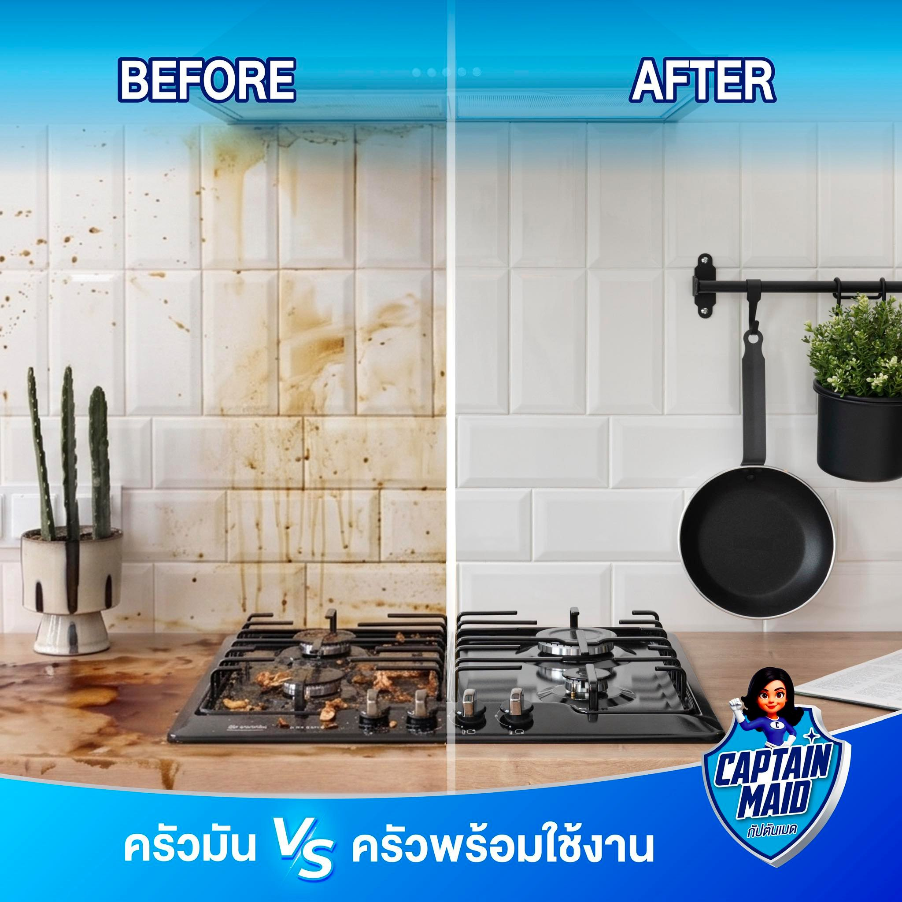
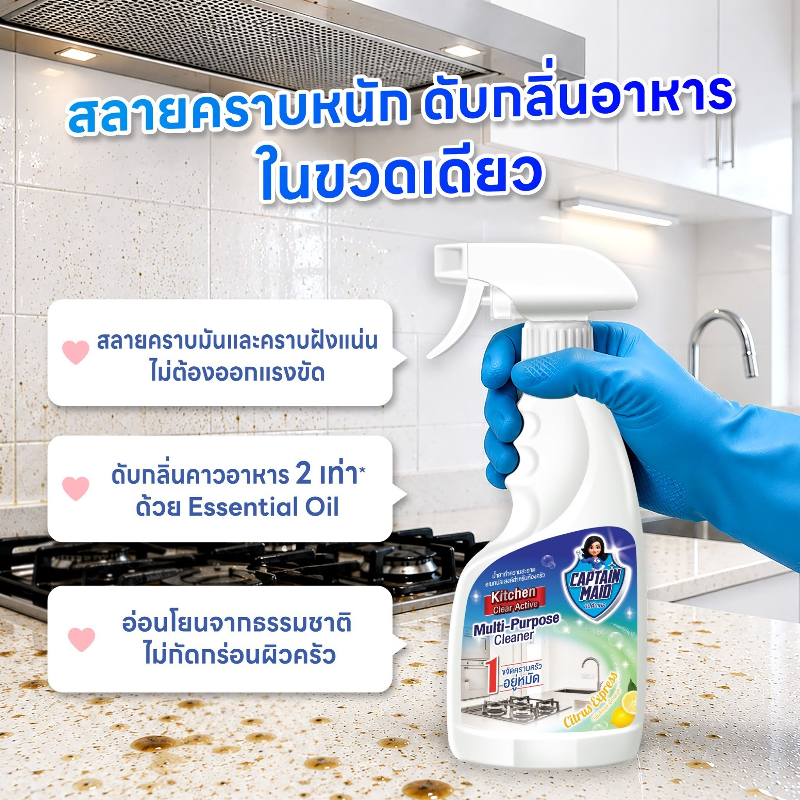
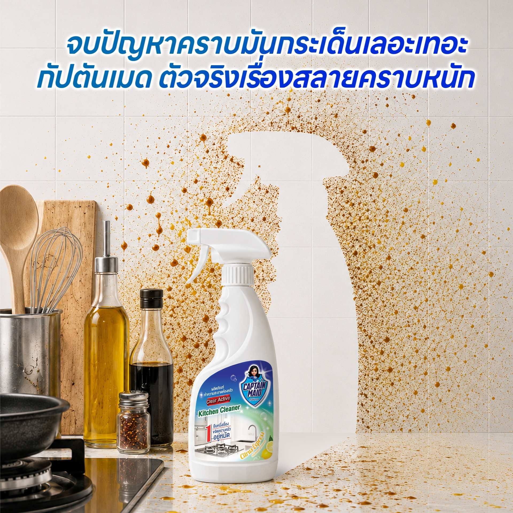

# ทริคทำความสะอาดห้องครัว สลายคราบมัน คราบฝังแน่น และดับกลิ่นคาว

"ห้องครัว" คือหัวใจของบ้าน แต่ก็เป็นจุดที่ทำความสะอาดยากที่สุดเช่นกัน ทั้งคราบน้ำมันกระเด็นเลอะเทอะ คราบไหม้ฝังแน่นตามเตาแก๊ส ไปจนถึงกลิ่นคาวอาหารที่ลอยคลุ้งไปทั่วบ้าน ทำอาหารเสร็จทีไร เหนื่อยตอนเก็บล้างทุกที!

## จัดการคราบมันและกลิ่นคาวในพริบตา
  
เคล็ดลับสำคัญในการดูแลห้องครัวคือ "การทำความสะอาดทันที" หลังใช้งานเสร็จ เพื่อไม่ให้คราบน้ำมันและเศษอาหารฝังแน่นจนกลายเป็นแหล่งสะสมของเชื้อโรค แต่การใช้แค่น้ำเปล่าหรือน้ำยาล้างจานทั่วไปอาจเอาคราบหนักๆ ไม่อยู่

## ไอเทมลับคู่ครัว: Captain Maid Kitchen Multi-Purpose Cleaner
  
เพื่อให้ครัวของคุณสะอาดวับพร้อมใช้งานเสมอ เราขอแนะนำ **ผลิตภัณฑ์ทำความสะอาดครัว Captain Maid (Kitchen Multi-Purpose Cleaner)** ตัวช่วยที่จัดการได้ครบ จบทุกปัญหาในครัว!

**ความดีงามที่ครัวคุณคู่ควร:**
*   **สลายคราบมัน คราบไหม้ฝังแน่น:** ทรงพลังด้วยประสิทธิภาพการดักจับคราบมันที่ฝังลึก ไม่ต้องออกแรงขัดจนกล้ามขึ้น ฉีดปุ๊บ เช็ดปั๊บ สะอาดทันตาเห็น
*   **ดับกลิ่นคาวอาหาร 2 เท่า:** ลืมปัญหากลิ่นอาหารกวนใจไปได้เลย ด้วยส่วนผสมของ **Essential Oil** (Citrus Express) ที่ผสานกลิ่นส้มและมะนาวสด ช่วยบูสต์ความสดชื่นและดับกลิ่นคาวที่รุนแรงแค่ไหนก็เอาอยู่
*   **จบปัญหาคราบมันกระเด็นเลอะเทอะ:** เช็ดทำความสะอาดได้ทั้งบริเวณเตา ผนังครัว และเคาน์เตอร์
*   **อ่อนโยนจากธรรมชาติ:** ปลอดภัยต่อการใช้งานในบริเวณที่ต้องสัมผัสกับอาหาร ไม่กัดกร่อนทำลายพื้นผิววัสดุในครัวของคุณ

สนุกกับการทำอาหารได้อย่างเต็มที่ โดยไม่ต้องกังวลเรื่องการทำความสะอาดอีกต่อไป ยกหน้าที่จัดการคราบหนักและกลิ่นคาวให้ **Captain Maid** ดูแลครัวของคุณนะคะ!