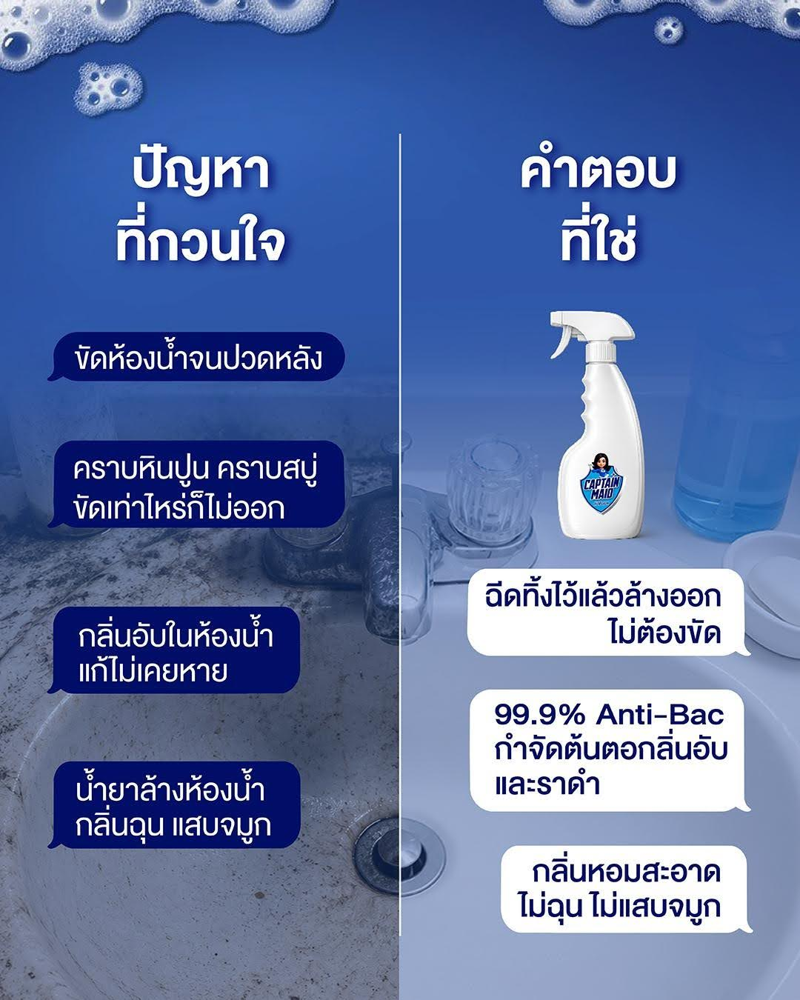
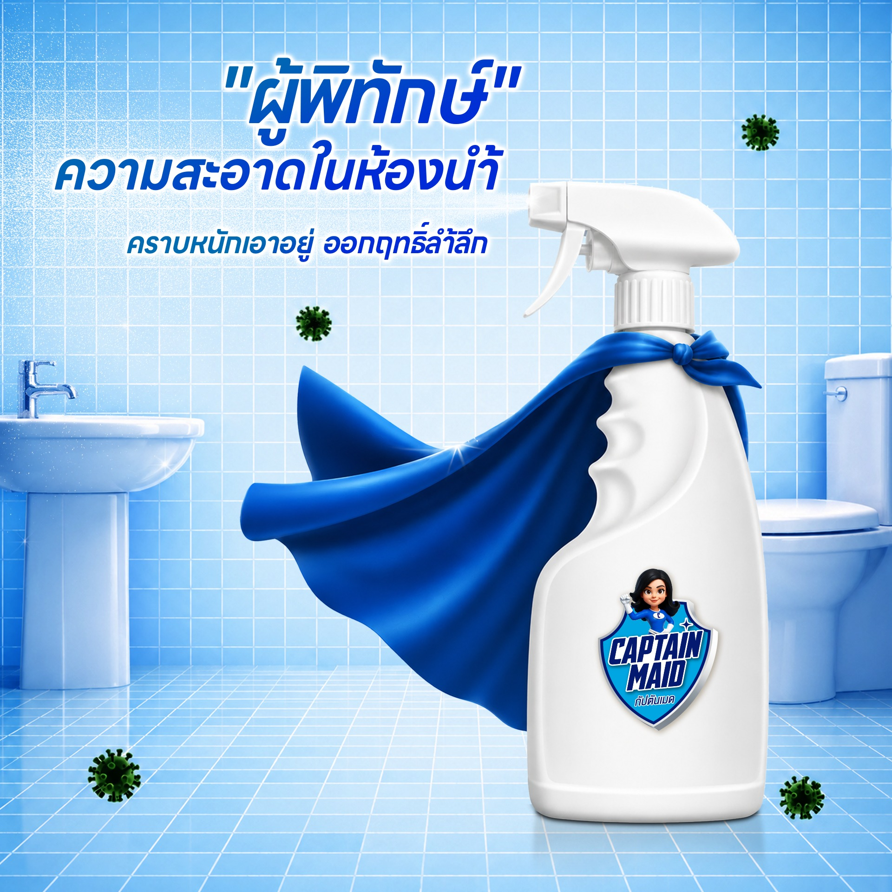
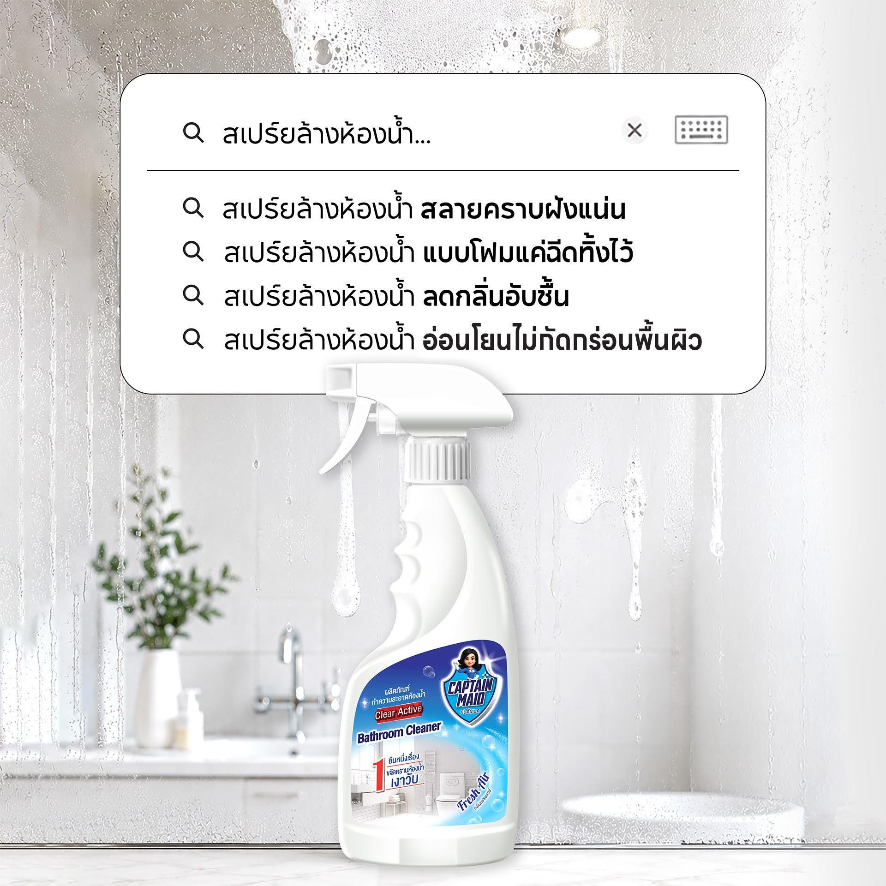

# เคล็ดลับล้างห้องน้ำให้สะอาดกริ๊บ โดยไม่ต้องออกแรงขัดให้ปวดหลัง

การล้างห้องน้ำมักเป็นงานบ้านที่หลายคนส่ายหน้าหนี! ทั้งคราบสบู่ คราบหินปูนฝังแน่น ขัดเท่าไหร่ก็ไม่ออก แถมบางทียังต้องทนดมกลิ่นน้ำยาล้างห้องน้ำที่ฉุนจนแสบจมูก แสบตา ทำเอาปวดหลัง ปวดหัวไปตามๆ กัน

## ปัญหาคลาสสิกของการล้างห้องน้ำ
*   **คราบฝังแน่น:** คราบน้ำ คราบหินปูน และคราบสบู่ที่เกาะตามพื้นและผนัง
*   **กลิ่นอับชื้นและเชื้อรา:** กลิ่นไม่พึงประสงค์ที่แก้ไม่เคยหายขาด
*   **น้ำยาทำความสะอาดกลิ่นฉุนรุนแรง:** ทำลายระบบทางเดินหายใจและกัดกร่อนพื้นผิว

## "ผู้พิทักษ์ความสะอาด" ตัวจริง: สเปรย์ล้างห้องน้ำ Captain Maid
  
บอกลาการขัดห้องน้ำจนปวดหลังไปได้เลย! แค่มี **สเปรย์ล้างห้องน้ำ Captain Maid (Active Bathroom Cleaner)** ไอเทมเด็ดที่ช่วยสลายคราบฝังแน่นได้อย่างง่ายดาย ไม่ต้องออกแรงขัดให้เหนื่อย

**จุดเด่นที่ทำให้คุณต้องว้าว!**
*   **แค่ฉีดทิ้งไว้ สเปรย์โฟมสลายคราบ:** ด้วยรูปแบบเนื้อโฟมที่เกาะติดคราบได้ดีเยี่ยม เพียงแค่ฉีดทิ้งไว้แล้วล้างออก คราบสกปรก คราบสบู่ ก็หลุดออกอย่างง่ายดาย ไม่เปลืองแรงขัด
*   **กำจัดแบคทีเรีย 99.9% (Anti-Bac):** กำจัดต้นตอของกลิ่นอับชื้นและราดำได้อย่างล้ำลึก 
*   **กลิ่นหอมสะอาด ไม่ฉุนแสบจมูก:** เปลี่ยนบรรยากาศห้องน้ำให้หอมสดชื่น (Fresh Air) ไร้กลิ่นสารเคมีรุนแรงที่ทำให้ระคายเคือง
*   **อ่อนโยน ไม่กัดกร่อนพื้นผิว:** มั่นใจได้ว่ากระเบื้องและสุขภัณฑ์ของคุณจะยังคงเงางาม ไม่ถูกทำลายจากกรดรุนแรง

เปลี่ยนงานล้างห้องน้ำที่แสนน่าเบื่อให้กลายเป็นเรื่องชิลๆ สบายๆ ด้วย **Captain Maid** สเปรย์ล้างห้องน้ำขวดเดียวจบ ครบทั้งเรื่องความสะอาดและสุขอนามัยที่ดีของทุกคนในบ้านค่ะ!