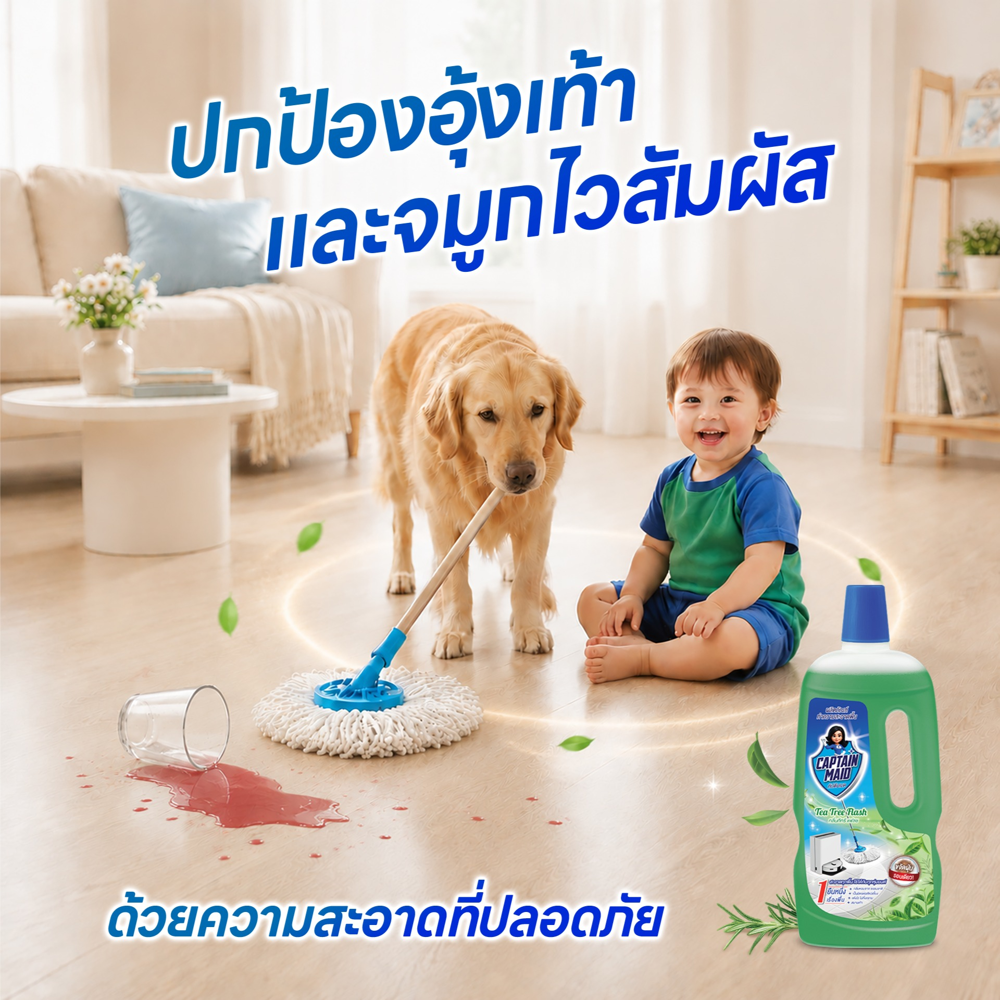
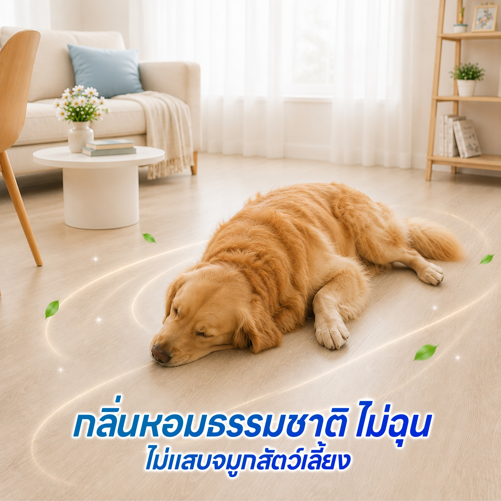
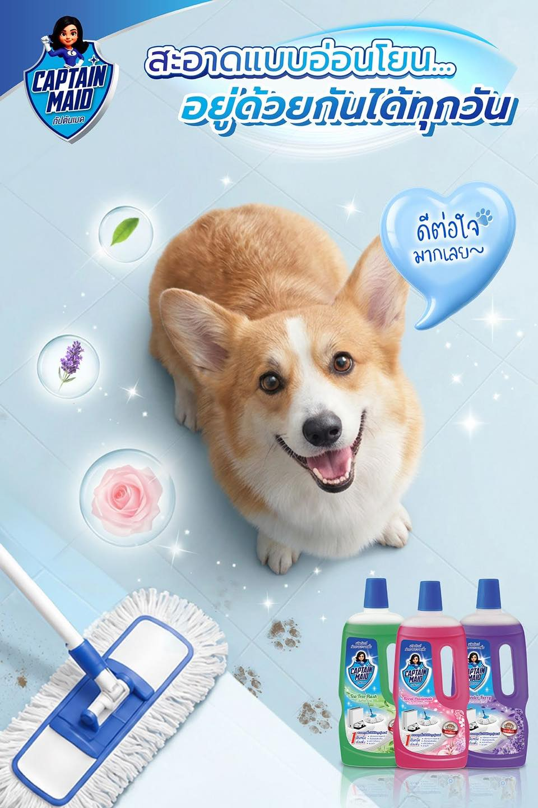

# ทำความสะอาดบ้านที่มีสัตว์เลี้ยงยังไงให้ปลอดภัย และไร้กลิ่นอับ?

สำหรับคนรักสัตว์ "น้องหมาน้องแมว" ก็เปรียบเสมือนสมาชิกในครอบครัว แต่ปัญหาที่ตามมาติดๆ คือ เรื่องของ "กลิ่นอับ กลิ่นฉี่" และความกังวลในการเลือกใช้น้ำยาทำความสะอาดบ้าน เพราะพื้นบ้านคือพื้นที่ที่น้องๆ ใช้ชีวิต เดิน วิ่ง นั่ง นอน และมักจะเลียเท้าตัวเองอยู่เสมอ หากใช้น้ำยาที่มีสารเคมีตกค้าง อาจเป็นอันตรายต่อสุขภาพของพวกเค้าได้

## ข้อควรระวังในการทำความสะอาดบ้านที่มีสัตว์เลี้ยง
*   หลีกเลี่ยงผลิตภัณฑ์ที่มีส่วนผสมของแอมโมเนียและสารฟอกขาว เพราะอาจทำให้ระบบทางเดินหายใจของสัตว์เลี้ยงระคายเคือง
*   ระวังสารเคมีตกค้างบนพื้น ที่อาจซึมผ่านอุ้งเท้าหรือสัตว์เลี้ยงเผลอเลียเข้าไป
*   เลือกใช้ผลิตภัณฑ์ที่ดับกลิ่นได้จริง ไม่ใช่แค่เอาความหอมมากลบกลิ่นเหม็น

## Captain Maid ห่วงใยเพื่อนซี้สี่ขา สะอาด ปลอดภัย ไร้กังวล
  
หากคุณกำลังมองหาน้ำยาถูพื้นที่เป็นมิตรกับสัตว์เลี้ยง (Pet-Friendly) **ผลิตภัณฑ์ทำความสะอาดพื้น Captain Maid** คือคำตอบที่ใช่ที่สุดค่ะ!

*   **ปกป้องอุ้งเท้าและจมูกที่ไวต่อสัมผัส:** ด้วยสูตร **5 FREE** ปราศจากสารเคมีรุนแรง (SLS, Ammonia, Phosphate, Paraben, Formaldehyde) ไม่ทิ้งคราบสารเคมีตกค้างให้กังวลใจ อ่อนโยน ไม่กัดผิวบอบบาง
*   **สารสกัดจากพืชธรรมชาติ (Plant-Based):** ใช้สารทำความสะอาดที่สกัดจากธรรมชาติ ปลอดภัย เป็นมิตรกับสัตว์เลี้ยง น้องๆ สามารถวิ่งเล่น กลิ้งเกลือกบนพื้นได้อย่างปลอดภัย
*   **พื้นแห้งไว วิ่งเพลินไม่ลื่น:** เช็ดปุ๊บ แห้งปั๊บ ไม่เหนียวเหนอะหนะ
*   **ขจัดกลิ่นอับ ดับกลิ่นสัตว์เลี้ยง:** แนะนำกลิ่น **Tea Tree Flash** ที่มีส่วนผสมของทีทรีและยูคาลิปตัส ช่วยลดกลิ่นอับ บูสต์ความสดชื่น ทำให้บ้านหอมสะอาด โล่งจมูกทั้งคนและสัตว์เลี้ยง

เพราะความปลอดภัยของทุกคนในบ้าน (รวมถึงเจ้าสี่ขา) คือสิ่งสำคัญที่สุด เลือก **Captain Maid** เพื่อให้บ้านสะอาด หอมสดชื่น และอยู่ร่วมกันอย่างมีความสุขในทุกๆ วันนะคะ