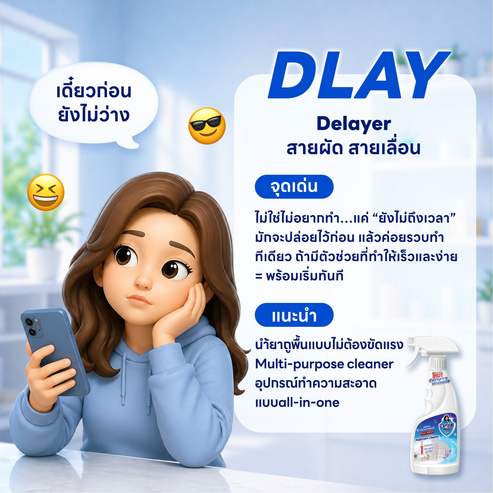
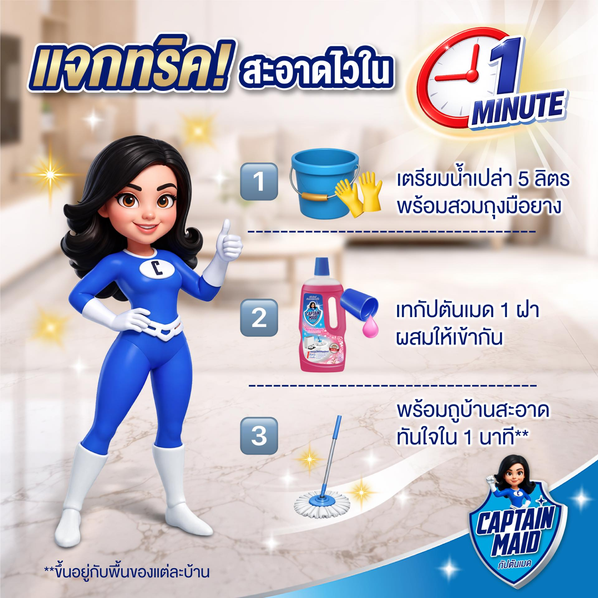
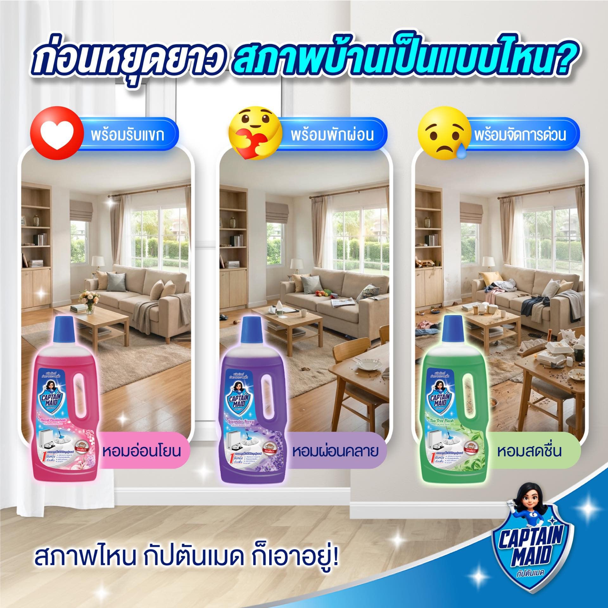

# ทริคทำความสะอาดบ้านฉบับคนไม่มีเวลา สะอาดไวใน 1 นาที

ชีวิตยุคใหม่ที่เต็มไปด้วยความเร่งรีบ ทำงานกลับมาก็เหนื่อยแทบขาดใจ จะเอาเวลาที่ไหนไปปัดกวาดเช็ดถูบ้าน? หลายคนกลายเป็น "สายผัดวันประกันพรุ่ง" ปล่อยคราบสกปรกสะสมไว้จนบ้านรก แล้วค่อยมารวบยอดทำทีเดียวตอนวันหยุดยาว แต่จะดีกว่าไหมถ้าเรามีทริคทำความสะอาดให้เสร็จไว ประหยัดแรง และพร้อมรับแขกเสมอ!

## ทริคความสะอาดฉับไว สไตล์คนเวลาน้อย
1. **เก็บของเข้าที่วันละ 5 นาที:** อย่าปล่อยให้ของรกสะสม เห็นอะไรวางผิดที่ให้เก็บทันที
2. **เช็ดทันทีที่เปื้อน:** ไม่ว่าจะน้ำหก คราบกระเด็นตอนทำอาหาร ให้เช็ดทันที อย่ารอให้คราบฝังลึก
3. **ใช้ตัวช่วย All-in-One และหุ่นยนต์ทำความสะอาด:** การมีผู้ช่วยและอุปกรณ์ที่ใช่ จะลดเวลาทำความสะอาดไปได้เกินครึ่ง!

## จบทุกงานบ้านอย่างรวดเร็วด้วย Captain Maid
  
ไม่ต้องเสียเวลาขัดถูนานๆ อีกต่อไป เมื่อคุณมีตัวช่วยสุดปังอย่าง **ผลิตภัณฑ์ทำความสะอาดจาก Captain Maid** ที่ออกแบบมาเพื่อคนรักความรวดเร็ว (Fast & Effective)

*   **พื้นสะอาดเงางามในรอบเดียว:** **น้ำยาถูพื้นกัปตันเมด** ผสมน้ำเพียง 1 ฝา ก็ถูพื้นได้สะอาดกริ๊บ แห้งไว ไม่ทิ้งรอยเท้า ไม่ต้องถูน้ำเปล่าซ้ำ แถมยัง **รองรับการใช้งานร่วมกับหุ่นยนต์ถูพื้น** ตอบโจทย์สายไฮเทคสุดๆ ปล่อยหุ่นยนต์วิ่งไป แถมบ้านยังหอมฟุ้ง!
*   **ห้องน้ำสะอาด แค่ฉีดแล้วล้าง:** สเปรย์โฟมล้างห้องน้ำ กัปตันเมด เพียงฉีดทิ้งไว้ที่คราบสกปรก แล้วใช้น้ำฉีดล้างออก ไม่ต้องลงไปนั่งขัดให้เสียเวลาและปวดหลัง
*   **ครัวสะอาดทันตาเห็น:** สเปรย์ทำความสะอาดครัว สลายคราบมันและกลิ่นคาวได้ทันที ฉีดปุ๊บเช็ดปั๊บ จบงานไวในรอบเดียว

ไม่ว่าสภาพบ้านจะยุ่งเหยิงแค่ไหน ก่อนหยุดยาวหรือมีแขกมาเยือนกะทันหัน ก็พร้อมรับมือเสมอ! เปลี่ยนวันทำความสะอาดที่แสนเหน็ดเหนื่อย ให้เป็นเรื่องง่ายและรวดเร็วด้วย **Captain Maid** ผู้ช่วยคนใหม่ที่รู้ใจบ้านคุณที่สุดค่ะ